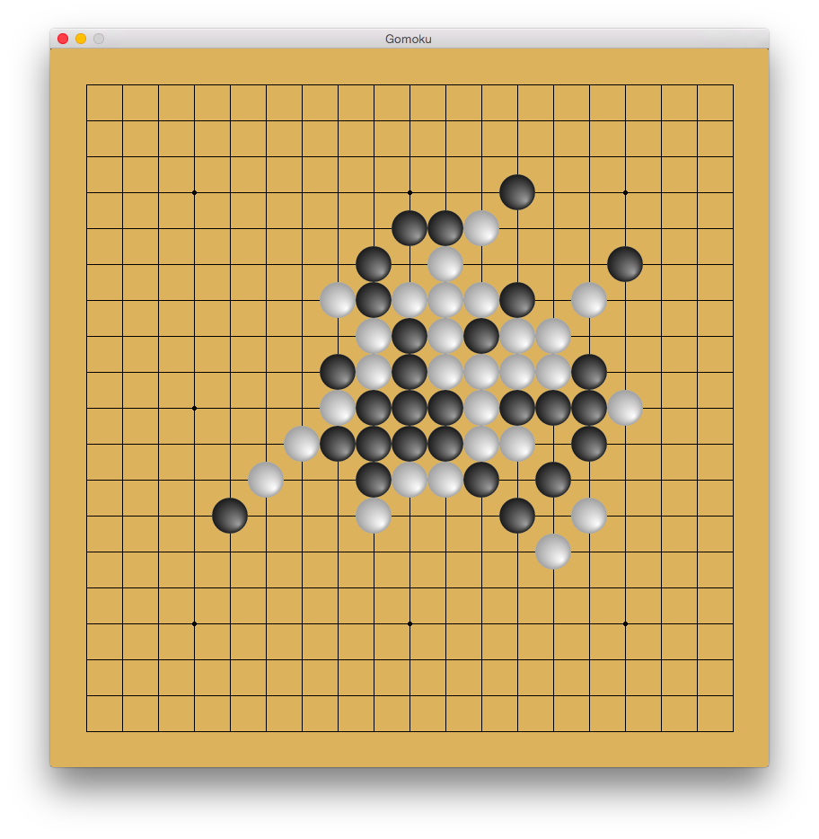

<div align="center">
  <h1>Gomoku</h1>
  <p>
    <strong>
      The classic five-in-a-row board game
    </strong>
  </p>
  <p>
    <a href="https://rubygems.org/gems/gomoku">
      
    </a>
  </p>
  
</div>

## Introduction

Challenge a friend or take on the AI. Gomoku is built with [Gosu](https://www.libgosu.org), the 2D game library for Ruby.

## Installation

Gosu dependencies (macOS).

```sh
brew install sdl2
```

For Linux dependencies, read [Getting Started on Linux](https://github.com/gosu/gosu/wiki/Getting-Started-on-Linux).

Install dependencies.

```sh
bundle install
```

And play.

```sh
bundle exec gomoku
```

## Todo

- Build basic AI
- Add menus
- Add network play
